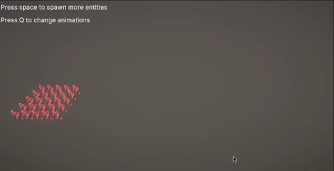

# unity-dots-animation
Simple animation system for the unity dots stack.

!!! IMPORTANT: ONLY WORKS WITH THE OLD TRANSFORM SYSTEM ATM! !!!

## Samples

### Benchmark Scence

To execute the sample:

1. Open or create a unity 2022.2 project using the URP pipeline
2. Add the script define symbol `ENABLE_TRANSFORM_V1`in the project settings
3. Add the package using the package manager -> "Add package from git url" using the https url of this repo
4. Go to the samples tab of this package in the package manager and open the benchmark sample
5. Open the "SampleScene"
